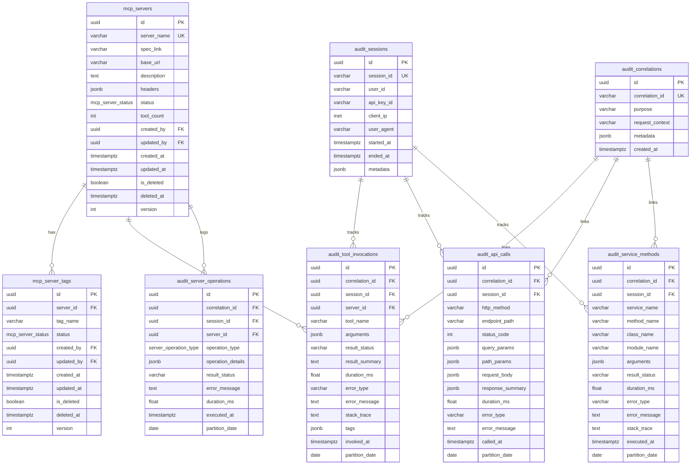

# MCP Server Registry - PostgreSQL Database Schema Design

## Overview

This document describes the comprehensive PostgreSQL database schema for persisting MCP (Model Context Protocol) server registry data and maintaining detailed audit trails. The schema is designed to replace the current in-memory storage (`_registry` global variable in `service/mcp_service.py`) with durable, queryable persistence while maintaining comprehensive audit capabilities.

---

## Table of Contents

1. [Entity Relationship Diagram](#entity-relationship-diagram)
2. [Enum Definitions](#enum-definitions)
3. [MCP Server Registry Tables](#mcp-server-registry-tables)
4. [Audit Trail Tables](#audit-trail-tables)
5. [Indexes and Performance](#indexes-and-performance)
6. [Constraints](#constraints)
7. [Partitioning Strategy](#partitioning-strategy)
8. [Sample Queries](#sample-queries)
9. [Migration Strategy](#migration-strategy)

---

## Entity Relationship Diagram



---

## Enum Definitions

### `mcp_server_status`

Represents the operational status of MCP servers and their tags.

```sql
CREATE TYPE mcp_server_status AS ENUM (
    'ACTIVE',
    'DISABLED',
    'ERROR'
);
```

| Value     | Description                                           |
|-----------|-------------------------------------------------------|
| `ACTIVE`  | Server/tag is operational and accepting requests      |
| `DISABLED`| Server/tag is temporarily disabled                    |
| `ERROR`   | Server/tag encountered an error and is non-functional |

### `server_operation_type`

Represents the types of operations performed on MCP servers.

```sql
CREATE TYPE server_operation_type AS ENUM (
    'MOUNT',
    'UNMOUNT',
    'ENABLE',
    'DISABLE',
    'REMOVE',
    'UPDATE_CONFIG'
);
```

### `audit_operation_status`

Represents the status of audited operations.

```sql
CREATE TYPE audit_operation_status AS ENUM (
    'STARTED',
    'SUCCESS',
    'FAILURE',
    'TIMEOUT'
);
```

---

## MCP Server Registry Tables

### Table: `mcp_servers`

Stores the main MCP server registry information, replacing `_mounted_servers`, `_server_configs`, and `_server_status`.

| Column        | Type                | Constraints                              | Description                                      |
|---------------|---------------------|------------------------------------------|--------------------------------------------------|
| `id`          | `UUID`              | `PRIMARY KEY DEFAULT gen_random_uuid()`  | Unique identifier                                |
| `server_name` | `VARCHAR(255)`      | `NOT NULL UNIQUE`                        | Unique server identifier (e.g., "weather-api")   |
| `spec_link`   | `TEXT`              | `NOT NULL`                               | URL to OpenAPI specification                     |
| `base_url`    | `VARCHAR(2048)`     | `NOT NULL`                               | Base URL for API calls                           |
| `description` | `TEXT`              | `NULL`                                   | Human-readable description                       |
| `headers`     | `JSONB`             | `NULL DEFAULT '{}'`                      | Default headers for API calls                    |
| `status`      | `mcp_server_status` | `NOT NULL DEFAULT 'ACTIVE'`              | Overall server status                            |
| `tool_count`  | `INTEGER`           | `NOT NULL DEFAULT 0`                     | Cached count of available tools                  |
| `created_by`  | `VARCHAR(255)`      | `NULL`                                   | User/system that created the record              |
| `updated_by`  | `VARCHAR(255)`      | `NULL`                                   | User/system that last updated the record         |
| `created_at`  | `TIMESTAMPTZ`       | `NOT NULL DEFAULT NOW()`                 | Creation timestamp                               |
| `updated_at`  | `TIMESTAMPTZ`       | `NOT NULL DEFAULT NOW()`                 | Last update timestamp                            |
| `is_deleted`  | `BOOLEAN`           | `NOT NULL DEFAULT FALSE`                 | Soft delete flag                                 |
| `deleted_at`  | `TIMESTAMPTZ`       | `NULL`                                   | Soft delete timestamp                            |
| `version`     | `INTEGER`           | `NOT NULL DEFAULT 1`                     | Optimistic locking version                       |

**DDL:**

```sql
CREATE TABLE mcp_servers (
    id UUID PRIMARY KEY DEFAULT gen_random_uuid(),
    server_name VARCHAR(255) NOT NULL UNIQUE,
    spec_link TEXT NOT NULL,
    base_url VARCHAR(2048) NOT NULL,
    description TEXT,
    headers JSONB DEFAULT '{}',
    status mcp_server_status NOT NULL DEFAULT 'ACTIVE',
    tool_count INTEGER NOT NULL DEFAULT 0,
    created_by VARCHAR(255),
    updated_by VARCHAR(255),
    created_at TIMESTAMPTZ NOT NULL DEFAULT NOW(),
    updated_at TIMESTAMPTZ NOT NULL DEFAULT NOW(),
    is_deleted BOOLEAN NOT NULL DEFAULT FALSE,
    deleted_at TIMESTAMPTZ,
    version INTEGER NOT NULL DEFAULT 1,
    
    CONSTRAINT chk_base_url_format CHECK (base_url ~ '^https?://'),
    CONSTRAINT chk_tool_count_non_negative CHECK (tool_count >= 0)
);
```

---

### Table: `mcp_server_tags`

Stores tag-level status for each server, replacing `_server_tags` dictionary.

| Column        | Type                | Constraints                             | Description                                      |
|---------------|---------------------|-----------------------------------------|--------------------------------------------------|
| `id`          | `UUID`              | `PRIMARY KEY DEFAULT gen_random_uuid()` | Unique identifier                                |
| `server_id`   | `UUID`              | `NOT NULL REFERENCES mcp_servers(id)`   | Foreign key to server                            |
| `tag_name`    | `VARCHAR(255)`      | `NOT NULL`                              | Tag name from OpenAPI spec                       |
| `status`      | `mcp_server_status` | `NOT NULL DEFAULT 'ACTIVE'`             | Tag-specific status                              |
| `created_by`  | `VARCHAR(255)`      | `NULL`                                  | Creator identifier                               |
| `updated_by`  | `VARCHAR(255)`      | `NULL`                                  | Last modifier identifier                         |
| `created_at`  | `TIMESTAMPTZ`       | `NOT NULL DEFAULT NOW()`                | Creation timestamp                               |
| `updated_at`  | `TIMESTAMPTZ`       | `NOT NULL DEFAULT NOW()`                | Last update timestamp                            |
| `is_deleted`  | `BOOLEAN`           | `NOT NULL DEFAULT FALSE`                | Soft delete flag                                 |
| `deleted_at`  | `TIMESTAMPTZ`       | `NULL`                                  | Soft delete timestamp                            |
| `version`     | `INTEGER`           | `NOT NULL DEFAULT 1`                    | Optimistic locking version                       |

**DDL:**

```sql
CREATE TABLE mcp_server_tags (
    id UUID PRIMARY KEY DEFAULT gen_random_uuid(),
    server_id UUID NOT NULL REFERENCES mcp_servers(id) ON DELETE CASCADE,
    tag_name VARCHAR(255) NOT NULL,
    status mcp_server_status NOT NULL DEFAULT 'ACTIVE',
    created_by VARCHAR(255),
    updated_by VARCHAR(255),
    created_at TIMESTAMPTZ NOT NULL DEFAULT NOW(),
    updated_at TIMESTAMPTZ NOT NULL DEFAULT NOW(),
    is_deleted BOOLEAN NOT NULL DEFAULT FALSE,
    deleted_at TIMESTAMPTZ,
    version INTEGER NOT NULL DEFAULT 1,
    
    CONSTRAINT uq_server_tag UNIQUE (server_id, tag_name)
);
```

---

## Audit Trail Tables

### Table: `audit_sessions`

Tracks user sessions for audit trail correlation.

| Column        | Type           | Constraints                              | Description                                      |
|---------------|----------------|------------------------------------------|--------------------------------------------------|
| `id`          | `UUID`         | `PRIMARY KEY DEFAULT gen_random_uuid()`  | Unique identifier                                |
| `session_id`  | `VARCHAR(255)` | `NOT NULL UNIQUE`                        | External session identifier                      |
| `user_id`     | `VARCHAR(255)` | `NULL`                                   | Authenticated user identifier                    |
| `api_key_id`  | `VARCHAR(255)` | `NULL`                                   | API key used for authentication                  |
| `client_ip`   | `INET`         | `NULL`                                   | Client IP address                                |
| `user_agent`  | `TEXT`         | `NULL`                                   | Client user agent string                         |
| `started_at`  | `TIMESTAMPTZ`  | `NOT NULL DEFAULT NOW()`                 | Session start timestamp                          |
| `ended_at`    | `TIMESTAMPTZ`  | `NULL`                                   | Session end timestamp                            |
| `metadata`    | `JSONB`        | `NULL DEFAULT '{}'`                      | Additional session context                       |

**DDL:**

```sql
CREATE TABLE audit_sessions (
    id UUID PRIMARY KEY DEFAULT gen_random_uuid(),
    session_id VARCHAR(255) NOT NULL UNIQUE,
    user_id VARCHAR(255),
    api_key_id VARCHAR(255),
    client_ip INET,
    user_agent TEXT,
    started_at TIMESTAMPTZ NOT NULL DEFAULT NOW(),
    ended_at TIMESTAMPTZ,
    metadata JSONB DEFAULT '{}'
);
```

---

### Table: `audit_correlations`

Tracks correlation IDs for distributed request tracing.

| Column            | Type           | Constraints                              | Description                                      |
|-------------------|----------------|------------------------------------------|--------------------------------------------------|
| `id`              | `UUID`         | `PRIMARY KEY DEFAULT gen_random_uuid()`  | Unique identifier                                |
| `correlation_id`  | `VARCHAR(255)` | `NOT NULL UNIQUE`                        | Correlation ID for request tracing               |
| `purpose`         | `TEXT`         | `NULL`                                   | Business purpose/intent of the request           |
| `request_context` | `TEXT`         | `NULL`                                   | Context about the request origin                 |
| `metadata`        | `JSONB`        | `NULL DEFAULT '{}'`                      | Additional correlation context                   |
| `created_at`      | `TIMESTAMPTZ`  | `NOT NULL DEFAULT NOW()`                 | Correlation creation timestamp                   |

**DDL:**

```sql
CREATE TABLE audit_correlations (
    id UUID PRIMARY KEY DEFAULT gen_random_uuid(),
    correlation_id VARCHAR(255) NOT NULL UNIQUE,
    purpose TEXT,
    request_context TEXT,
    metadata JSONB DEFAULT '{}',
    created_at TIMESTAMPTZ NOT NULL DEFAULT NOW()
);
```

---

### Table: `audit_tool_invocations`

Comprehensive audit log for MCP tool invocations (high-write volume).

| Column            | Type                    | Constraints                                   | Description                                      |
|-------------------|-------------------------|-----------------------------------------------|--------------------------------------------------|
| `id`              | `UUID`                  | `PRIMARY KEY DEFAULT gen_random_uuid()`       | Unique identifier                                |
| `correlation_id`  | `VARCHAR(255)`          | `NULL REFERENCES audit_correlations(correlation_id)` | Correlation for request tracing           |
| `session_id`      | `VARCHAR(255)`          | `NULL REFERENCES audit_sessions(session_id)`  | Link to session                                |
| `server_id`       | `UUID`                  | `NULL REFERENCES mcp_servers(id)`             | Source MCP server                                |
| `tool_name`       | `VARCHAR(500)`          | `NOT NULL`                                    | Name of invoked tool                             |
| `arguments`       | `JSONB`                 | `NULL`                                        | Tool arguments (sanitized)                       |
| `result_status`   | `audit_operation_status`| `NOT NULL`                                    | Operation result status                          |
| `result_summary`  | `TEXT`                  | `NULL`                                        | Summary of result                                |
| `duration_ms`     | `DOUBLE PRECISION`      | `NOT NULL`                                    | Execution duration in milliseconds               |
| `error_type`      | `VARCHAR(255)`          | `NULL`                                        | Type of error if failed                          |
| `error_message`   | `TEXT`                  | `NULL`                                        | Error message if failed                          |
| `stack_trace`     | `TEXT`                  | `NULL`                                        | Stack trace if failed                            |
| `tags`            | `JSONB`                 | `NULL`                                        | Associated tags                                  |
| `invoked_at`      | `TIMESTAMPTZ`           | `NOT NULL DEFAULT NOW()`                      | Invocation timestamp                             |
| `partition_date`  | `DATE`                  | `NOT NULL DEFAULT CURRENT_DATE`               | Partition key for table partitioning             |

**DDL:**

```sql
CREATE TABLE audit_tool_invocations (
    id UUID PRIMARY KEY DEFAULT gen_random_uuid(),
    correlation_id VARCHAR(255) REFERENCES audit_correlations(correlation_id),
    session_id VARCHAR(255) REFERENCES audit_sessions(session_id),
    server_id UUID REFERENCES mcp_servers(id),
    tool_name VARCHAR(500) NOT NULL,
    arguments JSONB,
    result_status audit_operation_status NOT NULL,
    result_summary TEXT,
    duration_ms DOUBLE PRECISION NOT NULL,
    error_type VARCHAR(255),
    error_message TEXT,
    stack_trace TEXT,
    tags JSONB,
    invoked_at TIMESTAMPTZ NOT NULL DEFAULT NOW(),
    partition_date DATE NOT NULL DEFAULT CURRENT_DATE
) PARTITION BY RANGE (partition_date);
```

---

### Table: `audit_api_calls`

Audit log for API endpoint calls.

| Column            | Type                    | Constraints                                   | Description                                      |
|-------------------|-------------------------|-----------------------------------------------|--------------------------------------------------|
| `id`              | `UUID`                  | `PRIMARY KEY DEFAULT gen_random_uuid()`       | Unique identifier                                |
| `correlation_id`  | `VARCHAR(255)`          | `NULL REFERENCES audit_correlations(correlation_id)` | Correlation for request tracing           |
| `session_id`      | `VARCHAR(255)`          | `NULL REFERENCES audit_sessions(session_id)`  | Link to session                                |
| `http_method`     | `VARCHAR(10)`           | `NOT NULL`                                    | HTTP method (GET, POST, etc.)                    |
| `endpoint_path`   | `VARCHAR(2048)`         | `NOT NULL`                                    | API endpoint path                                |
| `status_code`     | `INTEGER`               | `NULL`                                        | HTTP response status code                        |
| `query_params`    | `JSONB`                 | `NULL`                                        | Query parameters                                 |
| `path_params`     | `JSONB`                 | `NULL`                                        | Path parameters                                  |
| `request_body`    | `JSONB`                 | `NULL`                                        | Request body (sanitized)                         |
| `response_summary`| `JSONB`                 | `NULL`                                        | Response summary                                 |
| `duration_ms`     | `DOUBLE PRECISION`      | `NOT NULL`                                    | Request duration in milliseconds                 |
| `error_type`      | `VARCHAR(255)`          | `NULL`                                        | Error type if failed                             |
| `error_message`   | `TEXT`                  | `NULL`                                        | Error message if failed                          |
| `called_at`       | `TIMESTAMPTZ`           | `NOT NULL DEFAULT NOW()`                      | Request timestamp                                |
| `partition_date`  | `DATE`                  | `NOT NULL DEFAULT CURRENT_DATE`               | Partition key                                    |

**DDL:**

```sql
CREATE TABLE audit_api_calls (
    id UUID PRIMARY KEY DEFAULT gen_random_uuid(),
    correlation_id VARCHAR(255) REFERENCES audit_correlations(correlation_id),
    session_id VARCHAR(255) REFERENCES audit_sessions(session_id),
    http_method VARCHAR(10) NOT NULL,
    endpoint_path VARCHAR(2048) NOT NULL,
    status_code INTEGER,
    query_params JSONB,
    path_params JSONB,
    request_body JSONB,
    response_summary JSONB,
    duration_ms DOUBLE PRECISION NOT NULL,
    error_type VARCHAR(255),
    error_message TEXT,
    called_at TIMESTAMPTZ NOT NULL DEFAULT NOW(),
    partition_date DATE NOT NULL DEFAULT CURRENT_DATE
) PARTITION BY RANGE (partition_date);
```

---

### Table: `audit_service_methods`

Audit log for internal service method calls.

| Column            | Type                    | Constraints                                   | Description                                      |
|-------------------|-------------------------|-----------------------------------------------|--------------------------------------------------|
| `id`              | `UUID`                  | `PRIMARY KEY DEFAULT gen_random_uuid()`       | Unique identifier                                |
| `correlation_id`  | `VARCHAR(255)`          | `NULL REFERENCES audit_correlations(correlation_id)` | Correlation for request tracing           |
| `session_id`      | `VARCHAR(255)`          | `NULL REFERENCES audit_sessions(session_id)`  | Link to session                                |
| `service_name`    | `VARCHAR(255)`          | `NOT NULL`                                    | Name of the service                              |
| `method_name`     | `VARCHAR(255)`          | `NOT NULL`                                    | Name of the method                               |
| `class_name`      | `VARCHAR(255)`          | `NULL`                                        | Class name                                       |
| `module_name`     | `VARCHAR(255)`          | `NULL`                                        | Module name                                      |
| `arguments`       | `JSONB`                 | `NULL`                                        | Method arguments (sanitized)                     |
| `result_status`   | `audit_operation_status`| `NOT NULL`                                    | Operation result status                          |
| `duration_ms`     | `DOUBLE PRECISION`      | `NOT NULL`                                    | Execution duration in milliseconds               |
| `error_type`      | `VARCHAR(255)`          | `NULL`                                        | Error type if failed                             |
| `error_message`   | `TEXT`                  | `NULL`                                        | Error message if failed                          |
| `stack_trace`     | `TEXT`                  | `NULL`                                        | Stack trace if failed                            |
| `executed_at`     | `TIMESTAMPTZ`           | `NOT NULL DEFAULT NOW()`                      | Execution timestamp                              |
| `partition_date`  | `DATE`                  | `NOT NULL DEFAULT CURRENT_DATE`               | Partition key                                    |

**DDL:**

```sql
CREATE TABLE audit_service_methods (
    id UUID PRIMARY KEY DEFAULT gen_random_uuid(),
    correlation_id VARCHAR(255) REFERENCES audit_correlations(correlation_id),
    session_id VARCHAR(255) REFERENCES audit_sessions(session_id),
    service_name VARCHAR(255) NOT NULL,
    method_name VARCHAR(255) NOT NULL,
    class_name VARCHAR(255),
    module_name VARCHAR(255),
    arguments JSONB,
    result_status audit_operation_status NOT NULL,
    duration_ms DOUBLE PRECISION NOT NULL,
    error_type VARCHAR(255),
    error_message TEXT,
    stack_trace TEXT,
    executed_at TIMESTAMPTZ NOT NULL DEFAULT NOW(),
    partition_date DATE NOT NULL DEFAULT CURRENT_DATE
) PARTITION BY RANGE (partition_date);
```

---

### Table: `audit_server_operations`

Audit log for MCP server lifecycle operations.

| Column             | Type                    | Constraints                                   | Description                                      |
|--------------------|-------------------------|-----------------------------------------------|--------------------------------------------------|
| `id`               | `UUID`                  | `PRIMARY KEY DEFAULT gen_random_uuid()`       | Unique identifier                                |
| `correlation_id`   | `VARCHAR(255)`          | `NULL REFERENCES audit_correlations(correlation_id)` | Correlation for request tracing           |
| `session_id`       | `VARCHAR(255)`          | `NULL REFERENCES audit_sessions(session_id)`  | Link to session                                |
| `server_id`        | `UUID`                  | `NULL REFERENCES mcp_servers(id)`             | Target MCP server                                |
| `operation_type`   | `server_operation_type` | `NOT NULL`                                    | Type of operation                                |
| `operation_details`| `JSONB`                 | `NULL`                                        | Operation-specific details                       |
| `result_status`    | `audit_operation_status`| `NOT NULL`                                    | Operation result status                          |
| `error_message`    | `TEXT`                  | `NULL`                                        | Error message if failed                          |
| `duration_ms`      | `DOUBLE PRECISION`      | `NOT NULL`                                    | Operation duration                               |
| `executed_at`      | `TIMESTAMPTZ`           | `NOT NULL DEFAULT NOW()`                      | Operation timestamp                              |
| `partition_date`   | `DATE`                  | `NOT NULL DEFAULT CURRENT_DATE`               | Partition key                                    |

**DDL:**

```sql
CREATE TABLE audit_server_operations (
    id UUID PRIMARY KEY DEFAULT gen_random_uuid(),
    correlation_id VARCHAR(255) REFERENCES audit_correlations(correlation_id),
    session_id VARCHAR(255) REFERENCES audit_sessions(session_id),
    server_id UUID REFERENCES mcp_servers(id),
    operation_type server_operation_type NOT NULL,
    operation_details JSONB,
    result_status audit_operation_status NOT NULL,
    error_message TEXT,
    duration_ms DOUBLE PRECISION NOT NULL,
    executed_at TIMESTAMPTZ NOT NULL DEFAULT NOW(),
    partition_date DATE NOT NULL DEFAULT CURRENT_DATE
) PARTITION BY RANGE (partition_date);
```

---

## Indexes and Performance

### MCP Server Registry Indexes

```sql
-- Primary lookup by server_name
CREATE INDEX idx_mcp_servers_name ON mcp_servers(server_name) WHERE is_deleted = FALSE;

-- Status-based queries
CREATE INDEX idx_mcp_servers_status ON mcp_servers(status) WHERE is_deleted = FALSE;

-- Compound index for listing active servers
CREATE INDEX idx_mcp_servers_active ON mcp_servers(status, created_at) WHERE is_deleted = FALSE;

-- Soft delete queries
CREATE INDEX idx_mcp_servers_deleted ON mcp_servers(is_deleted, deleted_at) WHERE is_deleted = TRUE;
```

### MCP Server Tags Indexes

```sql
-- Foreign key index
CREATE INDEX idx_mcp_server_tags_server ON mcp_server_tags(server_id);

-- Tag name lookups
CREATE INDEX idx_mcp_server_tags_name ON mcp_server_tags(tag_name);

-- Active tags by server
CREATE INDEX idx_mcp_server_tags_active ON mcp_server_tags(server_id, status) WHERE is_deleted = FALSE;
```

### Audit Trail Indexes

```sql
-- Session correlation
CREATE INDEX idx_audit_tool_invocations_session ON audit_tool_invocations(session_id);
CREATE INDEX idx_audit_api_calls_session ON audit_api_calls(session_id);
CREATE INDEX idx_audit_service_methods_session ON audit_service_methods(session_id);

-- Correlation ID lookups (critical for request tracing)
CREATE INDEX idx_audit_tool_invocations_correlation ON audit_tool_invocations(correlation_id);
CREATE INDEX idx_audit_api_calls_correlation ON audit_api_calls(correlation_id);
CREATE INDEX idx_audit_service_methods_correlation ON audit_service_methods(correlation_id);

-- Server-specific audit queries
CREATE INDEX idx_audit_tool_invocations_server ON audit_tool_invocations(server_id);
CREATE INDEX idx_audit_server_operations_server ON audit_server_operations(server_id);

-- Tool performance analysis
CREATE INDEX idx_audit_tool_invocations_tool ON audit_tool_invocations(tool_name, invoked_at);
CREATE INDEX idx_audit_tool_invocations_duration ON audit_tool_invocations(duration_ms) WHERE duration_ms > 1000;

-- API endpoint performance
CREATE INDEX idx_audit_api_calls_endpoint ON audit_api_calls(endpoint_path, http_method);
CREATE INDEX idx_audit_api_calls_status ON audit_api_calls(status_code, called_at);

-- Error analysis
CREATE INDEX idx_audit_tool_invocations_error ON audit_tool_invocations(result_status, error_type) WHERE result_status = 'FAILURE';
CREATE INDEX idx_audit_api_calls_error ON audit_api_calls(status_code) WHERE status_code >= 400;

-- Time-based queries (leverage partitioning, but index for within-partition queries)
CREATE INDEX idx_audit_tool_invocations_time ON audit_tool_invocations(invoked_at DESC);
CREATE INDEX idx_audit_api_calls_time ON audit_api_calls(called_at DESC);
CREATE INDEX idx_audit_service_methods_time ON audit_service_methods(executed_at DESC);
```

---

## Constraints

### Check Constraints

```sql
-- Ensure valid HTTP methods
ALTER TABLE audit_api_calls 
ADD CONSTRAINT chk_http_method 
CHECK (http_method IN ('GET', 'POST', 'PUT', 'PATCH', 'DELETE', 'HEAD', 'OPTIONS', 'TRACE'));

-- Ensure valid HTTP status codes
ALTER TABLE audit_api_calls 
ADD CONSTRAINT chk_status_code 
CHECK (status_code >= 100 AND status_code <= 599);

-- Ensure duration is non-negative
ALTER TABLE audit_tool_invocations 
ADD CONSTRAINT chk_duration_non_negative 
CHECK (duration_ms >= 0);

ALTER TABLE audit_api_calls 
ADD CONSTRAINT chk_api_duration_non_negative 
CHECK (duration_ms >= 0);

ALTER TABLE audit_service_methods 
ADD CONSTRAINT chk_service_duration_non_negative 
CHECK (duration_ms >= 0);
```

### Foreign Key Constraints

All foreign keys use `ON DELETE SET NULL` for audit tables to preserve audit history even if referenced records are deleted:

```sql
-- Audit tables preserve history
ALTER TABLE audit_tool_invocations 
DROP CONSTRAINT IF EXISTS audit_tool_invocations_server_id_fkey,
ADD CONSTRAINT audit_tool_invocations_server_id_fkey 
FOREIGN KEY (server_id) REFERENCES mcp_servers(id) ON DELETE SET NULL;
```

---

## Partitioning Strategy

### Overview

Given the high-write nature of audit tables, we implement **range partitioning by date** on `partition_date` column. This allows:
- Efficient time-based queries
- Easy data retention management (drop old partitions)
- Parallel query execution across partitions

### Partition Creation

```sql
-- Create monthly partitions for audit_tool_invocations
CREATE TABLE audit_tool_invocations_y2024m01 
    PARTITION OF audit_tool_invocations
    FOR VALUES FROM ('2024-01-01') TO ('2024-02-01');

CREATE TABLE audit_tool_invocations_y2024m02 
    PARTITION OF audit_tool_invocations
    FOR VALUES FROM ('2024-02-01') TO ('2024-03-01');

-- Auto-creation function for new partitions
CREATE OR REPLACE FUNCTION create_audit_partitions()
RETURNS void AS $$
DECLARE
    start_date DATE;
    end_date DATE;
    partition_name TEXT;
BEGIN
    -- Create partitions for next 3 months
    FOR i IN 0..2 LOOP
        start_date := DATE_TRUNC('month', CURRENT_DATE + (i || ' months')::INTERVAL);
        end_date := DATE_TRUNC('month', CURRENT_DATE + ((i+1) || ' months')::INTERVAL);
        
        partition_name := 'audit_tool_invocations_y' || 
                         TO_CHAR(start_date, 'YYYY') || 'm' || TO_CHAR(start_date, 'MM');
        
        EXECUTE format(
            'CREATE TABLE IF NOT EXISTS %I PARTITION OF audit_tool_invocations FOR VALUES FROM (%L) TO (%L)',
            partition_name, start_date, end_date
        );
    END LOOP;
END;
$$ LANGUAGE plpgsql;
```

### Retention Policy

```sql
-- Automated partition cleanup (run monthly via cron/job scheduler)
CREATE OR REPLACE FUNCTION drop_old_audit_partitions(retention_months INTEGER DEFAULT 12)
RETURNS void AS $$
DECLARE
    partition_record RECORD;
    cutoff_date DATE;
BEGIN
    cutoff_date := CURRENT_DATE - (retention_months || ' months')::INTERVAL;
    
    FOR partition_record IN 
        SELECT tablename 
        FROM pg_tables 
        WHERE tablename LIKE 'audit_tool_invocations_y%'
          AND tablename < 'audit_tool_invocations_y' || TO_CHAR(cutoff_date, 'YYYY') || 'm' || TO_CHAR(cutoff_date, 'MM')
    LOOP
        EXECUTE format('DROP TABLE IF EXISTS %I', partition_record.tablename);
        RAISE NOTICE 'Dropped partition: %', partition_record.tablename;
    END LOOP;
END;
$$ LANGUAGE plpgsql;
```

---

## Sample Queries

### MCP Server Registry Queries

```sql
-- List all active servers with their tags
SELECT 
    s.id,
    s.server_name,
    s.base_url,
    s.status,
    s.tool_count,
    jsonb_agg(
        jsonb_build_object('tag', t.tag_name, 'status', t.status)
        ORDER BY t.tag_name
    ) FILTER (WHERE t.is_deleted = FALSE) AS tags
FROM mcp_servers s
LEFT JOIN mcp_server_tags t ON s.id = t.server_id
WHERE s.is_deleted = FALSE
GROUP BY s.id, s.server_name, s.base_url, s.status, s.tool_count;

-- Get server info by name (equivalent to get_server_info)
SELECT 
    s.server_name,
    s.spec_link,
    s.base_url,
    s.description,
    s.status,
    s.tool_count,
    COALESCE(
        jsonb_agg(
            jsonb_build_object('tag_name', t.tag_name, 'status', t.status)
        ) FILTER (WHERE t.id IS NOT NULL AND t.is_deleted = FALSE),
        '[]'::jsonb
    ) AS tags
FROM mcp_servers s
LEFT JOIN mcp_server_tags t ON s.id = t.server_id
WHERE s.server_name = 'weather-api' AND s.is_deleted = FALSE
GROUP BY s.id;

-- Update server status with optimistic locking
UPDATE mcp_servers
SET 
    status = 'DISABLED',
    updated_at = NOW(),
    updated_by = 'admin',
    version = version + 1
WHERE id = 'server-uuid' AND version = 5;
-- Check rows affected to detect version conflicts
```

### Audit Trail Queries

```sql
-- Trace a complete request by correlation ID
SELECT 
    'api' as operation_type,
    http_method || ' ' || endpoint_path as operation,
    duration_ms,
    status_code as status,
    called_at as timestamp
FROM audit_api_calls
WHERE correlation_id = 'abc-123'

UNION ALL

SELECT 
    'tool' as operation_type,
    tool_name as operation,
    duration_ms,
    result_status::text as status,
    invoked_at as timestamp
FROM audit_tool_invocations
WHERE correlation_id = 'abc-123'

UNION ALL

SELECT 
    'service' as operation_type,
    service_name || '.' || method_name as operation,
    duration_ms,
    result_status::text as status,
    executed_at as timestamp
FROM audit_service_methods
WHERE correlation_id = 'abc-123'

ORDER BY timestamp;

-- Find slow tool invocations (>1 second)
SELECT 
    ti.tool_name,
    s.server_name,
    ti.duration_ms,
    ti.arguments,
    ti.invoked_at,
    ti.correlation_id
FROM audit_tool_invocations ti
LEFT JOIN mcp_servers s ON ti.server_id = s.id
WHERE ti.duration_ms > 1000
  AND ti.invoked_at > NOW() - INTERVAL '24 hours'
ORDER BY ti.duration_ms DESC
LIMIT 100;

-- Error rate by server over last 24 hours
SELECT 
    s.server_name,
    COUNT(*) as total_invocations,
    COUNT(*) FILTER (WHERE ti.result_status = 'FAILURE') as error_count,
    ROUND(
        COUNT(*) FILTER (WHERE ti.result_status = 'FAILURE') * 100.0 / COUNT(*),
        2
    ) as error_rate_pct,
    AVG(ti.duration_ms) as avg_duration_ms
FROM audit_tool_invocations ti
LEFT JOIN mcp_servers s ON ti.server_id = s.id
WHERE ti.invoked_at > NOW() - INTERVAL '24 hours'
GROUP BY s.id, s.server_name
ORDER BY error_rate_pct DESC;

-- Most frequently used tools (last 7 days)
SELECT 
    ti.tool_name,
    s.server_name,
    COUNT(*) as invocation_count,
    AVG(ti.duration_ms) as avg_duration_ms,
    PERCENTILE_CONT(0.95) WITHIN GROUP (ORDER BY ti.duration_ms) as p95_duration_ms
FROM audit_tool_invocations ti
LEFT JOIN mcp_servers s ON ti.server_id = s.id
WHERE ti.invoked_at > NOW() - INTERVAL '7 days'
GROUP BY ti.tool_name, s.server_name
ORDER BY invocation_count DESC
LIMIT 20;

-- Session activity summary
SELECT 
    s.session_id,
    s.user_id,
    s.client_ip,
    s.started_at,
    COUNT(DISTINCT ti.id) as tool_invocations,
    COUNT(DISTINCT ac.id) as api_calls,
    MAX(ti.invoked_at) as last_activity
FROM audit_sessions s
LEFT JOIN audit_tool_invocations ti ON s.session_id = ti.session_id
LEFT JOIN audit_api_calls ac ON s.session_id = ac.session_id
WHERE s.started_at > NOW() - INTERVAL '24 hours'
GROUP BY s.id, s.session_id, s.user_id, s.client_ip, s.started_at
ORDER BY s.started_at DESC;
```

---

## Migration Strategy

### Phase 1: Schema Creation

1. **Create ENUM types** first to avoid dependency issues
2. **Create core tables** (`mcp_servers`, `mcp_server_tags`) 
3. **Create audit infrastructure** (`audit_sessions`, `audit_correlations`)
4. **Create partitioned audit tables** with initial partitions
5. **Create indexes** after tables are populated for better performance
6. **Set up partition automation** (function + scheduled job)

### Phase 2: Data Migration

```python
# Pseudocode for data migration
async def migrate_from_memory_to_db():
    registry = await get_registry()
    
    # Migrate server configs
    for server_name, config in registry._server_configs.items():
        server_id = await db.insert_mcp_server(
            server_name=config.server_name,
            spec_link=config.spec_link,
            base_url=config.base_url,
            description=config.description,
            headers=config.headers,
            status=registry._server_status.get(server_name, 'ACTIVE')
        )
        
        # Migrate tags
        tags = registry._server_tags.get(server_name, {})
        for tag_name, status in tags.items():
            await db.insert_mcp_server_tag(
                server_id=server_id,
                tag_name=tag_name,
                status=status
            )
```

### Phase 3: Application Integration

1. **Repository Layer**: Create async repository classes for each table
2. **Dual-Write Mode**: Write to both memory and DB during transition
3. **Read-Through**: Read from DB, fallback to memory
4. **Full Cutover**: Switch to DB-only after validation

### Phase 4: Validation

1. **Data Integrity Checks**: Compare memory vs DB counts
2. **Performance Benchmarks**: Ensure query performance meets SLAs
3. **Failover Testing**: Verify graceful degradation

### Rollback Plan

- Maintain in-memory registry alongside DB during transition
- Feature flag for DB persistence (can disable instantly)
- Database snapshots before migration

---

## Appendix: Complete DDL Script

```sql
-- =====================================================
-- MCP Server Registry Database Schema
-- PostgreSQL 14+
-- =====================================================

-- Enable required extensions
CREATE EXTENSION IF NOT EXISTS "uuid-ossp";
CREATE EXTENSION IF NOT EXISTS "pgcrypto";

-- =====================================================
-- ENUM TYPES
-- =====================================================

CREATE TYPE mcp_server_status AS ENUM ('ACTIVE', 'DISABLED', 'ERROR');
CREATE TYPE server_operation_type AS ENUM ('MOUNT', 'UNMOUNT', 'ENABLE', 'DISABLE', 'REMOVE', 'UPDATE_CONFIG');
CREATE TYPE audit_operation_status AS ENUM ('STARTED', 'SUCCESS', 'FAILURE', 'TIMEOUT');

-- =====================================================
-- CORE REGISTRY TABLES
-- =====================================================

CREATE TABLE mcp_servers (
    id UUID PRIMARY KEY DEFAULT gen_random_uuid(),
    server_name VARCHAR(255) NOT NULL UNIQUE,
    spec_link TEXT NOT NULL,
    base_url VARCHAR(2048) NOT NULL,
    description TEXT,
    headers JSONB DEFAULT '{}',
    status mcp_server_status NOT NULL DEFAULT 'ACTIVE',
    tool_count INTEGER NOT NULL DEFAULT 0,
    created_by VARCHAR(255),
    updated_by VARCHAR(255),
    created_at TIMESTAMPTZ NOT NULL DEFAULT NOW(),
    updated_at TIMESTAMPTZ NOT NULL DEFAULT NOW(),
    is_deleted BOOLEAN NOT NULL DEFAULT FALSE,
    deleted_at TIMESTAMPTZ,
    version INTEGER NOT NULL DEFAULT 1,
    CONSTRAINT chk_base_url_format CHECK (base_url ~ '^https?://'),
    CONSTRAINT chk_tool_count_non_negative CHECK (tool_count >= 0)
);

CREATE TABLE mcp_server_tags (
    id UUID PRIMARY KEY DEFAULT gen_random_uuid(),
    server_id UUID NOT NULL REFERENCES mcp_servers(id) ON DELETE CASCADE,
    tag_name VARCHAR(255) NOT NULL,
    status mcp_server_status NOT NULL DEFAULT 'ACTIVE',
    created_by VARCHAR(255),
    updated_by VARCHAR(255),
    created_at TIMESTAMPTZ NOT NULL DEFAULT NOW(),
    updated_at TIMESTAMPTZ NOT NULL DEFAULT NOW(),
    is_deleted BOOLEAN NOT NULL DEFAULT FALSE,
    deleted_at TIMESTAMPTZ,
    version INTEGER NOT NULL DEFAULT 1,
    CONSTRAINT uq_server_tag UNIQUE (server_id, tag_name)
);

-- =====================================================
-- AUDIT INFRASTRUCTURE
-- =====================================================

CREATE TABLE audit_sessions (
    id UUID PRIMARY KEY DEFAULT gen_random_uuid(),
    session_id VARCHAR(255) NOT NULL UNIQUE,
    user_id VARCHAR(255),
    api_key_id VARCHAR(255),
    client_ip INET,
    user_agent TEXT,
    started_at TIMESTAMPTZ NOT NULL DEFAULT NOW(),
    ended_at TIMESTAMPTZ,
    metadata JSONB DEFAULT '{}'
);

CREATE TABLE audit_correlations (
    id UUID PRIMARY KEY DEFAULT gen_random_uuid(),
    correlation_id VARCHAR(255) NOT NULL UNIQUE,
    purpose TEXT,
    request_context TEXT,
    metadata JSONB DEFAULT '{}',
    created_at TIMESTAMPTZ NOT NULL DEFAULT NOW()
);

-- =====================================================
-- PARTITIONED AUDIT TABLES
-- =====================================================

CREATE TABLE audit_tool_invocations (
    id UUID PRIMARY KEY DEFAULT gen_random_uuid(),
    correlation_id VARCHAR(255) REFERENCES audit_correlations(correlation_id),
    session_id VARCHAR(255) REFERENCES audit_sessions(session_id),
    server_id UUID REFERENCES mcp_servers(id) ON DELETE SET NULL,
    tool_name VARCHAR(500) NOT NULL,
    arguments JSONB,
    result_status audit_operation_status NOT NULL,
    result_summary TEXT,
    duration_ms DOUBLE PRECISION NOT NULL,
    error_type VARCHAR(255),
    error_message TEXT,
    stack_trace TEXT,
    tags JSONB,
    invoked_at TIMESTAMPTZ NOT NULL DEFAULT NOW(),
    partition_date DATE NOT NULL DEFAULT CURRENT_DATE,
    CONSTRAINT chk_tool_duration_non_negative CHECK (duration_ms >= 0)
) PARTITION BY RANGE (partition_date);

CREATE TABLE audit_api_calls (
    id UUID PRIMARY KEY DEFAULT gen_random_uuid(),
    correlation_id VARCHAR(255) REFERENCES audit_correlations(correlation_id),
    session_id VARCHAR(255) REFERENCES audit_sessions(session_id),
    http_method VARCHAR(10) NOT NULL,
    endpoint_path VARCHAR(2048) NOT NULL,
    status_code INTEGER,
    query_params JSONB,
    path_params JSONB,
    request_body JSONB,
    response_summary JSONB,
    duration_ms DOUBLE PRECISION NOT NULL,
    error_type VARCHAR(255),
    error_message TEXT,
    called_at TIMESTAMPTZ NOT NULL DEFAULT NOW(),
    partition_date DATE NOT NULL DEFAULT CURRENT_DATE,
    CONSTRAINT chk_api_duration_non_negative CHECK (duration_ms >= 0),
    CONSTRAINT chk_status_code CHECK (status_code >= 100 AND status_code <= 599)
) PARTITION BY RANGE (partition_date);

CREATE TABLE audit_service_methods (
    id UUID PRIMARY KEY DEFAULT gen_random_uuid(),
    correlation_id VARCHAR(255) REFERENCES audit_correlations(correlation_id),
    session_id VARCHAR(255) REFERENCES audit_sessions(session_id),
    service_name VARCHAR(255) NOT NULL,
    method_name VARCHAR(255) NOT NULL,
    class_name VARCHAR(255),
    module_name VARCHAR(255),
    arguments JSONB,
    result_status audit_operation_status NOT NULL,
    duration_ms DOUBLE PRECISION NOT NULL,
    error_type VARCHAR(255),
    error_message TEXT,
    stack_trace TEXT,
    executed_at TIMESTAMPTZ NOT NULL DEFAULT NOW(),
    partition_date DATE NOT NULL DEFAULT CURRENT_DATE,
    CONSTRAINT chk_service_duration_non_negative CHECK (duration_ms >= 0)
) PARTITION BY RANGE (partition_date);

CREATE TABLE audit_server_operations (
    id UUID PRIMARY KEY DEFAULT gen_random_uuid(),
    correlation_id VARCHAR(255) REFERENCES audit_correlations(correlation_id),
    session_id VARCHAR(255) REFERENCES audit_sessions(session_id),
    server_id UUID REFERENCES mcp_servers(id) ON DELETE SET NULL,
    operation_type server_operation_type NOT NULL,
    operation_details JSONB,
    result_status audit_operation_status NOT NULL,
    error_message TEXT,
    duration_ms DOUBLE PRECISION NOT NULL,
    executed_at TIMESTAMPTZ NOT NULL DEFAULT NOW(),
    partition_date DATE NOT NULL DEFAULT CURRENT_DATE,
    CONSTRAINT chk_op_duration_non_negative CHECK (duration_ms >= 0)
) PARTITION BY RANGE (partition_date);

-- =====================================================
-- INDEXES
-- =====================================================

-- Registry indexes
CREATE INDEX idx_mcp_servers_name ON mcp_servers(server_name) WHERE is_deleted = FALSE;
CREATE INDEX idx_mcp_servers_status ON mcp_servers(status) WHERE is_deleted = FALSE;
CREATE INDEX idx_mcp_server_tags_server ON mcp_server_tags(server_id);
CREATE INDEX idx_mcp_server_tags_active ON mcp_server_tags(server_id, status) WHERE is_deleted = FALSE;

-- Audit indexes
CREATE INDEX idx_audit_tool_invocations_session ON audit_tool_invocations(session_id);
CREATE INDEX idx_audit_tool_invocations_correlation ON audit_tool_invocations(correlation_id);
CREATE INDEX idx_audit_tool_invocations_server ON audit_tool_invocations(server_id);
CREATE INDEX idx_audit_tool_invocations_tool ON audit_tool_invocations(tool_name, invoked_at);

CREATE INDEX idx_audit_api_calls_session ON audit_api_calls(session_id);
CREATE INDEX idx_audit_api_calls_correlation ON audit_api_calls(correlation_id);
CREATE INDEX idx_audit_api_calls_endpoint ON audit_api_calls(endpoint_path, http_method);

CREATE INDEX idx_audit_service_methods_session ON audit_service_methods(session_id);
CREATE INDEX idx_audit_service_methods_correlation ON audit_service_methods(correlation_id);

-- =====================================================
-- AUTO-UPDATE TRIGGER FOR updated_at
-- =====================================================

CREATE OR REPLACE FUNCTION update_updated_at_column()
RETURNS TRIGGER AS $$
BEGIN
    NEW.updated_at = NOW();
    RETURN NEW;
END;
$$ LANGUAGE plpgsql;

CREATE TRIGGER trg_mcp_servers_updated_at
    BEFORE UPDATE ON mcp_servers
    FOR EACH ROW
    EXECUTE FUNCTION update_updated_at_column();

CREATE TRIGGER trg_mcp_server_tags_updated_at
    BEFORE UPDATE ON mcp_server_tags
    FOR EACH ROW
    EXECUTE FUNCTION update_updated_at_column();

-- =====================================================
-- PARTITION MANAGEMENT
-- =====================================================

CREATE OR REPLACE FUNCTION create_audit_partitions()
RETURNS void AS $$
DECLARE
    start_date DATE;
    end_date DATE;
    partition_name TEXT;
    table_names TEXT[] := ARRAY[
        'audit_tool_invocations',
        'audit_api_calls', 
        'audit_service_methods',
        'audit_server_operations'
    ];
    tbl TEXT;
BEGIN
    FOR i IN 0..2 LOOP
        start_date := DATE_TRUNC('month', CURRENT_DATE + (i || ' months')::INTERVAL);
        end_date := DATE_TRUNC('month', CURRENT_DATE + ((i+1) || ' months')::INTERVAL);
        
        FOREACH tbl IN ARRAY table_names LOOP
            partition_name := tbl || '_y' || TO_CHAR(start_date, 'YYYY') || 'm' || TO_CHAR(start_date, 'MM');
            
            EXECUTE format(
                'CREATE TABLE IF NOT EXISTS %I PARTITION OF %I FOR VALUES FROM (%L) TO (%L)',
                partition_name, tbl, start_date, end_date
            );
        END LOOP;
    END LOOP;
END;
$$ LANGUAGE plpgsql;

-- Initialize partitions
SELECT create_audit_partitions();

-- =====================================================
-- END OF SCHEMA
-- =====================================================
```

---

## Notes

1. **JSONB Usage**: Used for flexible schema fields like `headers`, `arguments`, and `metadata` to accommodate varying data structures without schema migrations.

2. **Soft Deletes**: All registry tables implement soft deletes via `is_deleted` and `deleted_at` to maintain audit trail integrity.

3. **Optimistic Locking**: `version` column enables conflict detection in concurrent update scenarios.

4. **Partitioning**: Audit tables are range-partitioned by month for efficient data retention and query performance.

5. **Correlation Tracking**: The `audit_correlations` table enables distributed tracing across multiple services and operations.
